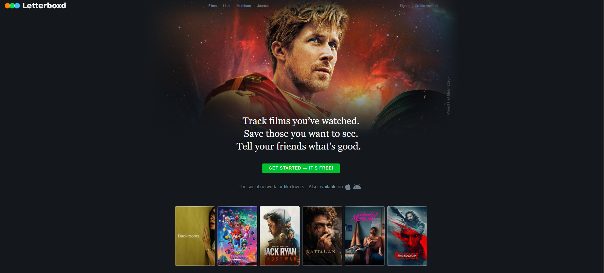
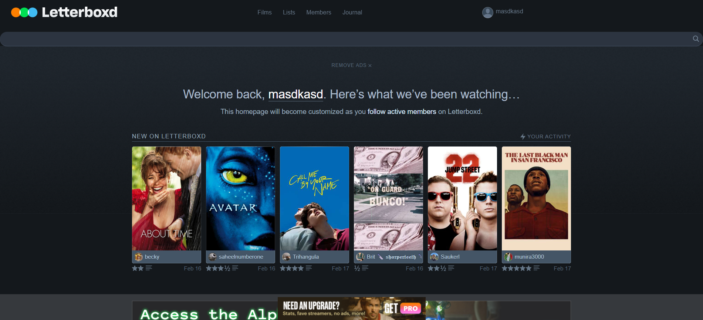
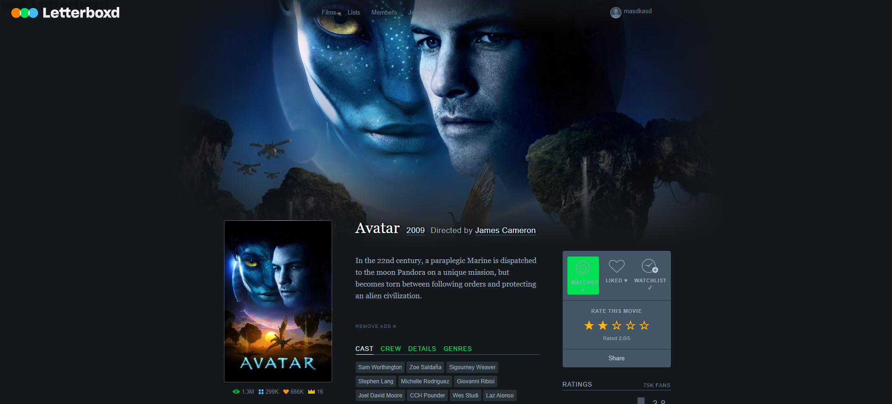
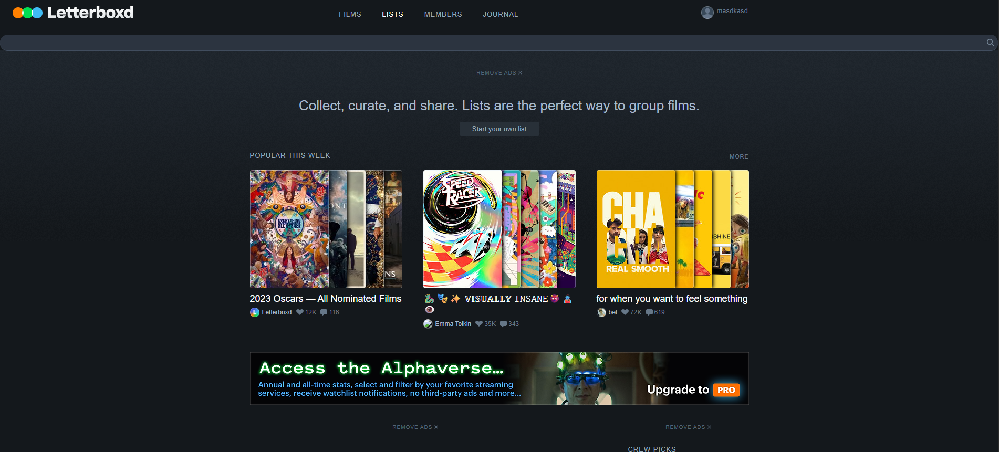
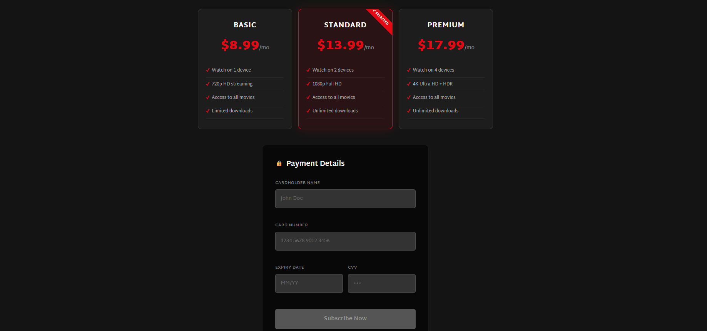

# 🎬 Letterboxd Clone

A premium, Letterbox-inspired movie streaming web application built from scratch. This project is a complete full-stack demonstration of advanced database management systems (ADMS) concepts, third-party API caching integration, and optimized system architecture.

---

## 🖼️ Application Screenshots

<div align="center">
  <h3>🏠 Landing Page</h3>
  

  <h3>💻 User Dashboard</h3>
  

  <h3>🎬 Film Details & Rating</h3>
  

  <h3>📋 Curated Movie Lists</h3>
  

  <h3>💳 Plan Selection & Billing</h3>
  
</div>

---

## 🎯 The Main Target of this Project

The primary goal of this project is to build a fully functional, high-performance entertainment streaming platform while showcasing how **complex business logic can be optimized by shifting it from the application layer directly into the database engine**. 

Rather than relying on resource-heavy backend application code, this project uses the raw power of **MySQL** to compute recommendations, manage active sessions, keep track of real-time viewing statistics, and handle transactional database operations safely.

---

## ✨ Why this Project is Unique

Unlike typical portfolio clones that only focus on frontend design or basic backend APIs, this project stands out for several key reasons:

1. **Database-Driven Personalization (The Custom `% Match` Algorithm)**
   Instead of using a separate machine learning microservice or heavy Node.js loops, a **custom MySQL User-Defined Function (UDF)** computes a user's movie preference match score. It queries their top-watched genres directly inside the database, delivering instant Netflix-style recommendation percentages.
   
2. **Robust Database-Level Integrity**
   All critical business operations are secured by **database triggers and atomic transactions**. For instance, view-count incrementation, average rating recalculation, and title auto-population happen asynchronously in the database via triggers, ensuring complete data consistency without extra API calls.

3. **Hybrid TMDb Live-Caching Fallback**
   The application fetches real-time movie details, posters, and reviews from the TMDb API. However, it incorporates a custom local caching system. Every fetched movie is indexed and stored in MySQL. If the TMDb API ever goes offline, the app automatically transitions to local cache fallback, ensuring **100% uptime**.

4. **Zero-Installation Portable Architecture**
   To eliminate the common "works on my machine" headache, the project includes fully self-contained portable runtimes for Node.js and MySQL. A developer can run the entire environment on Windows instantly without having to download or install any external software globally.

---

## 🚀 Key Features

### 💻 User Experience
- **Dynamic Catalog**: Browse trending, popular, and top-rated movies live.
- **Custom Watchlists & Ratings**: Save favorites, rate movies out of 5 stars, and leave likes.
- **"Continue Watching" Progress**: Resume playback exactly where you left off with interactive visual progress bars.
- **Custom Playlists**: Create, update, and manage your own custom movie collections.

### ⚙️ ADMS Database Architecture
- **Transactional Safety**: Uses strict `START TRANSACTION`, `COMMIT`, and `ROLLBACK` rules to handle secure, atomic signups and subscription billing.
- **Stored Procedures**: Encapsulates core queries (`RecordWatchHistory`, `AddToWatchlist`, `ActivateSubscription`) to protect against SQL injections and speed up execution.
- **Automated Triggers**: Fires events automatically on user actions to recalculate statistics in real-time.
- **Performance Indexes**: Strategic indexes on movie titles, genres, and user relations for sub-millisecond query results.

---

## 🛠️ Tech Stack

* **Backend**: Node.js & Express.js
* **Database**: MySQL 9.7 (with connection pooling)
* **Frontend**: Dynamic EJS Templates, Custom Vanilla CSS (Dark Theme & Glassmorphism UI)
* **APIs**: The Movie Database (TMDb) via Axios
* **Security & Auth**: JWT (JSON Web Tokens) inside `httpOnly` secure cookies & Bcrypt password hashing

---

## ⚡ How to Run the Project

This repository includes a portable setup allowing you to run the database and server in **one click** on Windows!

### 1. Configure Your Secrets
Create a `.env` file in the root folder of the project and add the following configuration:
```env
DB_HOST=localhost
DB_USER=netflix
DB_PASSWORD=netflix
DB_NAME=netflix_db
TMDB_API_KEY=your_tmdb_api_key_here
JWT_SECRET=your_jwt_secret_here
PORT=3500
SESSION_SECRET=your_session_secret_here
```

### 2. Launch the Application (One-Click)
Double-click **`run-everything.bat`** in the root directory.
*This starts the portable MySQL server, sets up the schema, and launches the Node.js website.*

### 3. Open in Browser
Once running, navigate to:
👉 **[http://localhost:3500](http://localhost:3500)**

---

## 🗄️ Database Connection Info

If you want to view the database visually (using a GUI tool like DBeaver or database explorer), use the following credentials:
* **Host**: `localhost`
* **Port**: `3306`
* **User**: `netflix`
* **Password**: `netflix`
* **Database**: `netflix_db`

---

## 📝 API Attribution

> This product uses the TMDb API but is not endorsed or certified by TMDb.

[](https://www.themoviedb.org/)
