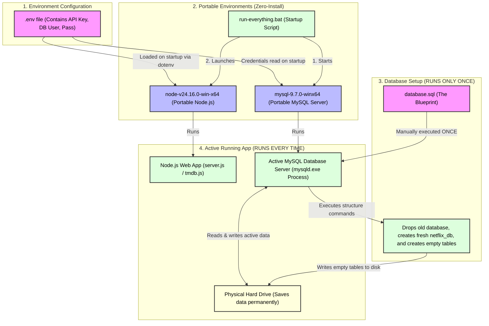
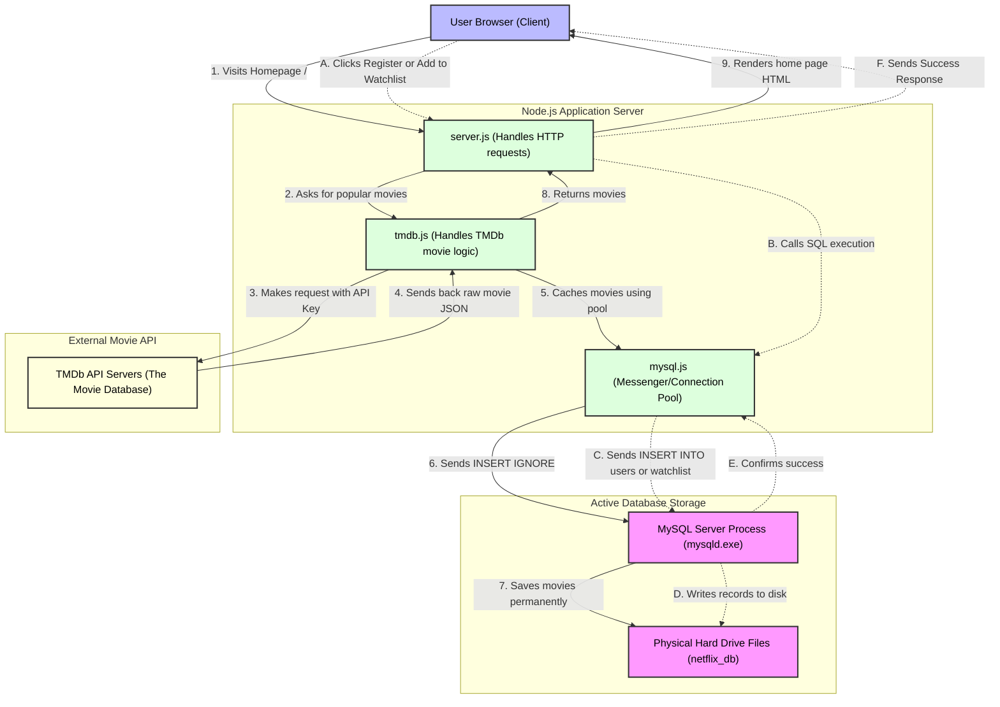
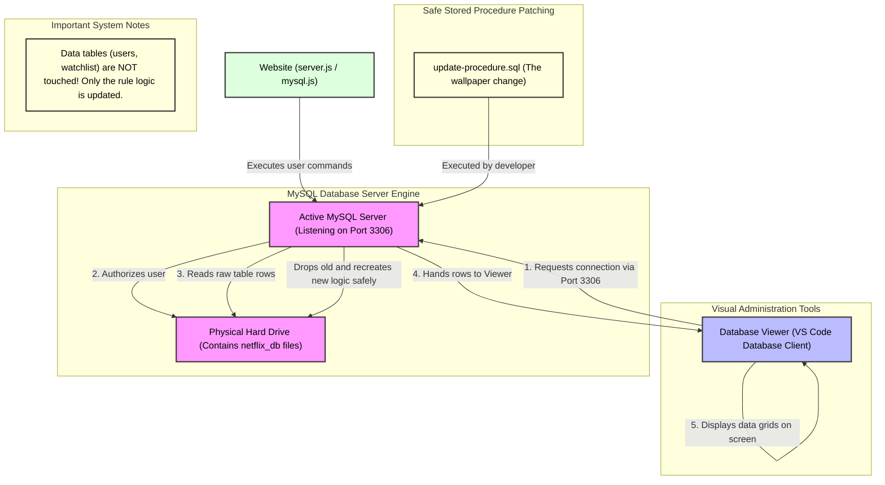

# Letterboxd Clone: System Architecture & Data Flow Diagrams

This document contains three detailed, high-level diagrams that explain the complete lifecycle, live flows, and storage mechanics of your web application. Together, they explain how every component interacts, where your secrets are loaded, and how your data is saved and viewed.

---

## Diagram 1: The Initialization & Setup Flow
*This diagram explains what happens on "Day 1" (initial setup) versus how the project runs daily using the portable Node and MySQL folders, and how the `.env` file is loaded into the system.*

### Key Takeaway for Diagram 1:
*   **`.env`** is loaded at the very beginning of the Node app startup.
*   **`database.sql`** is run **only once** to wipe the old structure and draw empty table "slots" on your **Hard Drive**.
*   **Portable folders** are started by `run-everything.bat` so you don't have to install Node or MySQL on Windows.

---

## Diagram 2: The Live Web Interactions & Movie Fetching Flow
*This diagram explains what happens in real time when a user visits the homepage, searches for a movie, registers an account, or adds a movie to their watchlist.*

### Key Takeaway for Diagram 2:
*   **`tmdb.js`** contacts the external TMDb server using your secret API key, fetches movie data, and caches it in your local database using `mysql.js`.
*   **`mysql.js`** acts as the delivery driver. When the user performs an action (like registering or adding a watchlist item), it carries the data to the MySQL Server database.

---

## Diagram 3: Database Administration, Viewer & Update Patch Flow
*This diagram explains how the Database Viewer connects to your system, how it reads from the disk, and how running a separate script like `update-procedure.sql` upgrades your rules without deleting user data.*

### Key Takeaway for Diagram 3:
*   The **Database Viewer** connects directly to the **MySQL Server** on Port 3306 (completely independent of your website).
*   **`update-procedure.sql`** is loaded directly into the server to update the stored procedure rules (like changing the subscription logic) without running any destructive commands on the actual tables where your users' active accounts are stored.
